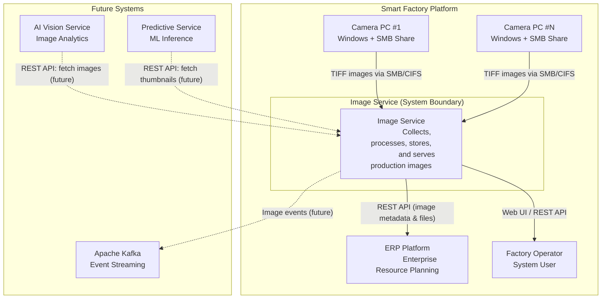
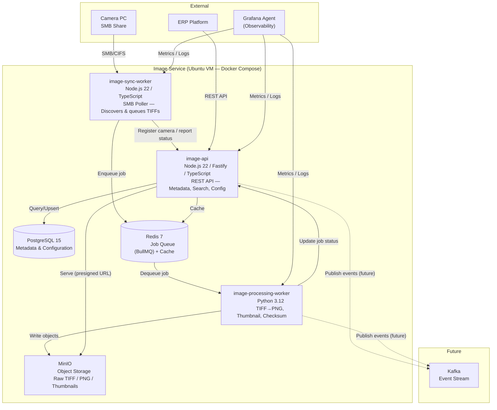
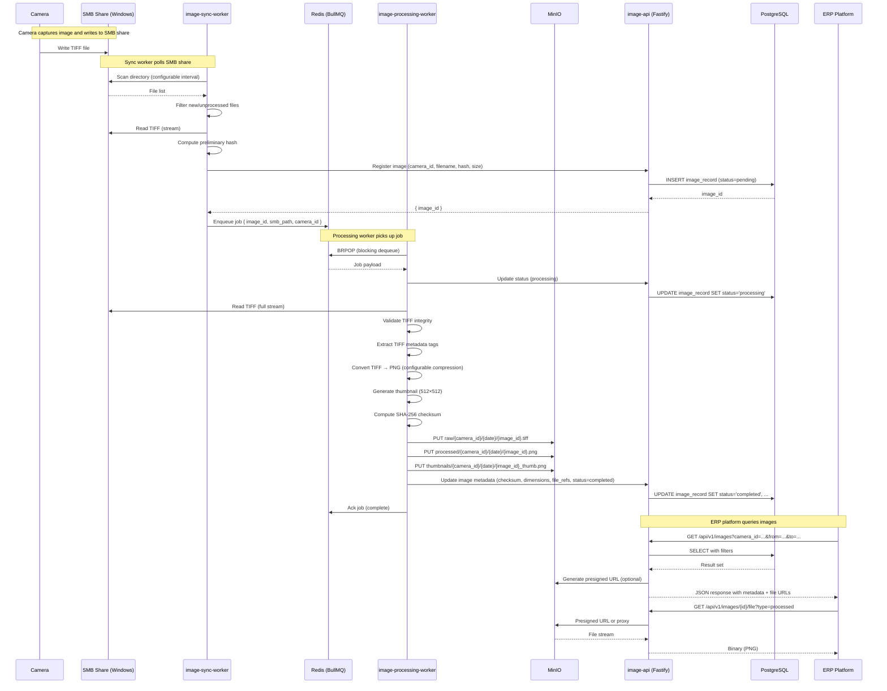
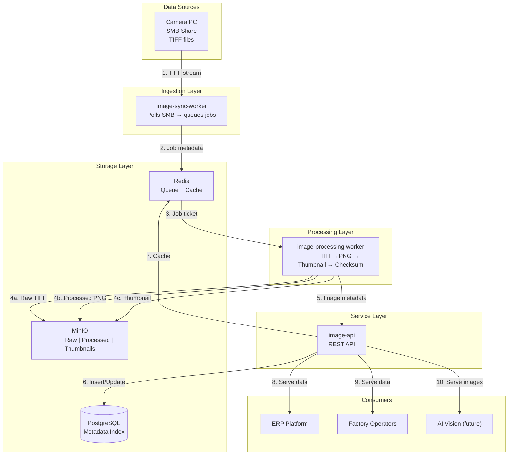
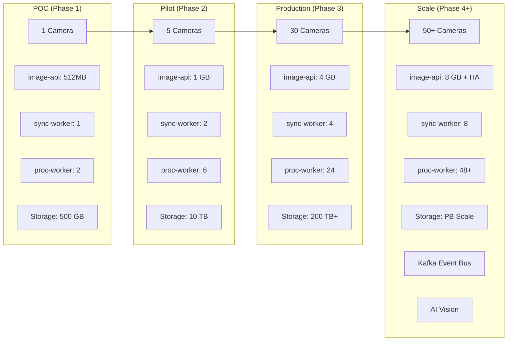
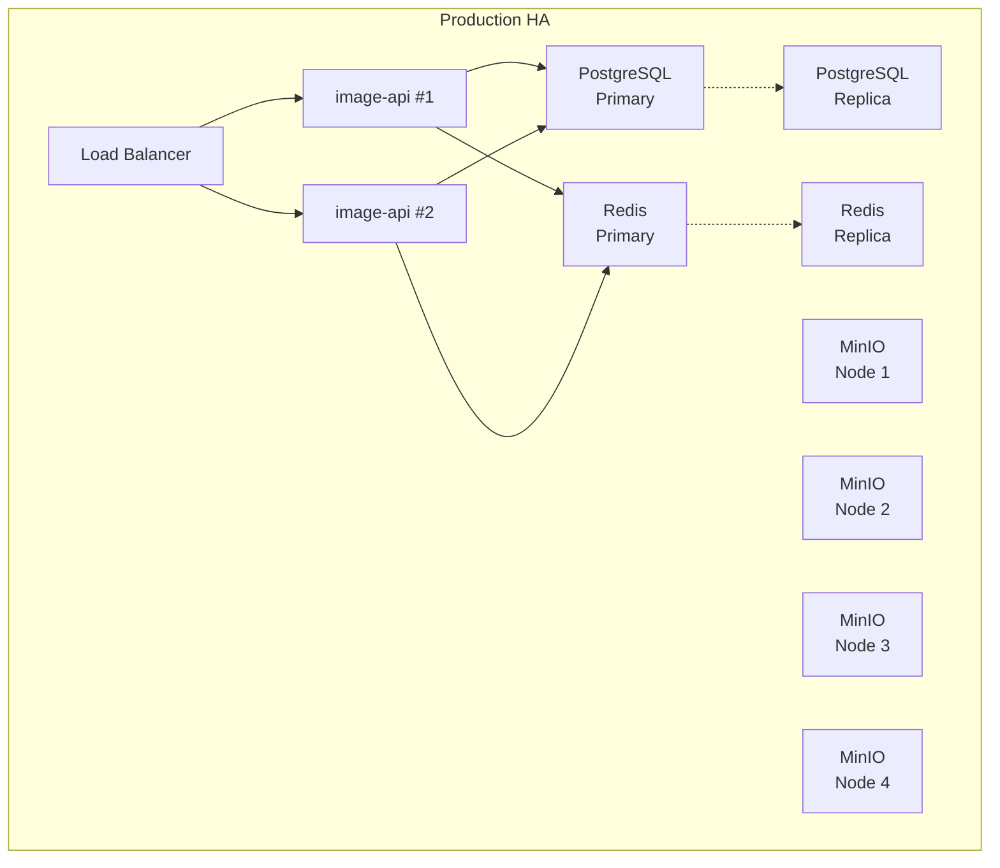

# Image Service — Enterprise Architecture Design

> **Version:** 1.0
> **Author:** Senior Solution Architect
> **Domain:** Smart Factory Platform
> **Status:** Draft for Review

---

## Table of Contents

1. [Context Diagram (C4 Level 1)](#1-context-diagram-c4-level-1)
2. [Container Diagram (C4 Level 2)](#2-container-diagram-c4-level-2)
3. [Sequence Diagram](#3-sequence-diagram)
4. [Data Flow Diagram](#4-data-flow-diagram)
5. [Storage Architecture](#5-storage-architecture)
6. [Capacity Planning](#6-capacity-planning)
7. [Key Design Decisions](#7-key-design-decisions)
8. [Future Integration Points](#8-future-integration-points)

---

## 1. Context Diagram (C4 Level 1)



**Context:**

| Element | Type | Description |
|---|---|---|
| Camera PC | External System | Windows machine with SMB share; writes TIFF images |
| ERP Platform | External System | Consumes image metadata via REST API |
| Factory Operator | User | Interacts with the system via API for search, review, configuration |
| Apache Kafka | Future System | Event bus for image lifecycle events |
| AI Vision Service | Future System | Reads processed images for defect detection |
| Predictive Service | Future System | Reads thumbnails for ML-based predictive maintenance |

---

## 2. Container Diagram (C4 Level 2)



### Container Responsibilities

| Container | Technology | Responsibilities |
|---|---|---|
| **image-api** | Node.js 22, TypeScript, Fastify | REST API; image metadata CRUD; search; retention management; camera config; health/monitoring endpoints; authentication/authorization |
| **image-sync-worker** | Node.js 22, TypeScript | Polls SMB shares on configurable intervals; discovers new TIFF files; computes preliminary hash; enqueues processing jobs; reports camera health |
| **image-processing-worker** | Python 3.12 | Reads TIFF; validates integrity; converts to PNG (multi-page support); generates thumbnail (512×512); computes SHA-256 checksum; applies optional compression; stores to MinIO; updates status via API |
| **PostgreSQL** | PostgreSQL 15 | Image metadata; camera registry; processing job history; retention policies; audit log; full-text search index |
| **Redis** | Redis 7 | BullMQ job queue (persistent); API response cache (TTL-based); rate-limit counters; heartbeat tracking |
| **MinIO** | MinIO (POC) / Synology NAS (Production) | Object storage for raw TIFF, processed PNG, thumbnails; supports bucket lifecycle policies; S3-compatible API |

---

## 3. Sequence Diagram



---

## 4. Data Flow Diagram



### Data Flow Steps

| Step | From | To | Data | Protocol |
|---|---|---|---|---|
| 1 | Camera PC | image-sync-worker | TIFF file (binary) | SMB/CIFS |
| 2 | image-sync-worker | Redis (BullMQ) | Job payload (JSON) | Redis Protocol |
| 3 | Redis | image-processing-worker | Job ticket (JSON) | Redis Protocol |
| 4a-c | image-processing-worker | MinIO | Raw TIFF / PNG / Thumbnail | S3 API (HTTPS) |
| 5 | image-processing-worker | image-api | Image metadata (JSON) | HTTP REST |
| 6 | image-api | PostgreSQL | Metadata rows | PostgreSQL wire |
| 7 | image-api | Redis | Cached responses | Redis Protocol |
| 8-10 | image-api | Consumers | JSON + Binary | HTTPS REST |

---

## 5. Storage Architecture

### 5.1 MinIO Bucket Structure

```
minio/
└── image-service/
    ├── raw/                          # Original TIFF files (short retention)
    │   └── {camera_id}/
    │       └── {YYYY-MM-DD}/
    │           └── {image_id}.tiff
    ├── processed/                    # Converted PNG files (medium retention)
    │   └── {camera_id}/
    │       └── {YYYY-MM-DD}/
    │           └── {image_id}.png
    └── thumbnails/                   # Thumbnails (long retention)
        └── {camera_id}/
            └── {YYYY-MM-DD}/
                └── {image_id}_thumb.png
```

**Bucket Lifecycle Policies (MinIO ILM):**

| Bucket | Retention | Action |
|---|---|---|
| `raw/` | 7 days | Expiry — auto-delete |
| `processed/` | 90 days | Expiry — auto-delete |
| `thumbnails/` | 365 days | Expiry — auto-delete |

> Retention periods are configurable per camera via the API. Raw TIFF expiry can trigger a notification for archival before deletion.

### 5.2 PostgreSQL Schema (Core Tables)

```mermaid
erDiagram
    cameras ||--o{ images : produces
    images ||--o{ image_files : has
    cameras ||--|| retention_policies : configured_by
    images ||--o{ processing_jobs : tracked_by
    images ||--o{ audit_log : recorded_in

    cameras {
        uuid id PK
        varchar name
        inet ip_address
        varchar smb_path
        varchar smb_domain
        varchar smb_username
        varchar status "active | inactive | error"
        int poll_interval_seconds
        jsonb metadata "manufacturer model resolution"
        timestamptz created_at
        timestamptz updated_at
    }

    images {
        uuid id PK
        uuid camera_id FK
        varchar filename
        bigint file_size_bytes
        varchar checksum_sha256
        varchar status "pending | processing | completed | failed | deleted"
        jsonb tiff_metadata "tiff tags extracted"
        int width_px
        int height_px
        int bit_depth
        int compression_ratio
        timestamptz captured_at
        timestamptz ingested_at
        timestamptz processed_at
        timestamptz deleted_at
        tsvector search_vector "full-text search"
    }

    image_files {
        uuid id PK
        uuid image_id FK
        varchar file_type "raw | processed | thumbnail"
        varchar bucket
        varchar object_key
        bigint file_size_bytes
        varchar checksum_sha256
        timestamptz created_at
    }

    retention_policies {
        uuid camera_id PK FK
        int raw_retention_days
        int processed_retention_days
        int thumbnail_retention_days
        boolean archive_raw_before_delete
        timestamptz updated_at
    }

    processing_jobs {
        uuid id PK
        uuid image_id FK
        varchar worker_id
        varchar status "queued | running | completed | failed"
        jsonb payload
        jsonb result
        text error_message
        timestamptz queued_at
        timestamptz started_at
        timestamptz completed_at
    }

    audit_log {
        bigint id PK
        uuid image_id FK
        varchar action "created | processed | viewed | deleted"
        varchar actor_type "system | user | api"
        varchar actor_id
        jsonb detail
        timestamptz created_at
    }
```

**Indexes:**

```sql
-- Primary search index
CREATE INDEX idx_images_camera_captured ON images (camera_id, captured_at DESC);

-- Full-text search
CREATE INDEX idx_images_search ON images USING GIN (search_vector);

-- Status-based queries
CREATE INDEX idx_images_status ON images (status) WHERE status NOT IN ('deleted');

-- Retention sweeper
CREATE INDEX idx_images_captured ON images (captured_at);

-- Job queue queries
CREATE INDEX idx_processing_jobs_status ON processing_jobs (status, queued_at);
```

### 5.3 Redis Data Structures

| Key Pattern | Type | Purpose | TTL |
|---|---|---|---|
| `bull:image-processing:*` | Sorted Set / List | BullMQ job queue | Persistent |
| `cache:api:{route_hash}` | String | API response cache | 30-300s (configurable) |
| `rate:limit:{client_ip}` | Sorted Set | Rate limiting | Rolling window |
| `heartbeat:worker:{id}` | String | Worker health tracking | 30s |
| `camera:lock:{camera_id}` | String | Prevent duplicate polling | Poll interval |
| `processing:image:{image_id}:lock` | String | Idempotent processing lock | 5 min |

---

## 6. Capacity Planning

### 6.1 Assumptions

| Parameter | Symbol | Low Volume | Medium Volume | High Volume | Unit |
|---|---|---|---|---|---|
| Cameras | C | 5 | 30 | 50 | units |
| Images per camera per day | I | 3,456 | 17,280 | 34,560 | images/day |
| **Total images per day** | **T** | **17,280** | **518,400** | **1,728,000** | images/day |
| Raw TIFF size (avg) | S_raw | 10 | 15 | 25 | MB |
| Processed PNG size (avg) | S_png | 2 | 3 | 5 | MB |
| Thumbnail size (avg) | S_thumb | 0.05 | 0.05 | 0.05 | MB |
| Metadata per image | S_meta | 0.002 | 0.002 | 0.002 | MB |

> *Low volume = on-demand capture (1 image/25s per camera)*
> *Medium volume = periodic capture (1 image/5s per camera)*
> *High volume = near-continuous capture (1 image/2.5s per camera)*

### 6.2 Storage Growth

**Per image storage:**
```
S_total = S_raw + S_png + S_thumb + S_meta
       = 15 + 3 + 0.05 + 0.002
       ≈ 18.05 MB/image
```

**Daily ingest by volume tier:**

| Tier | Daily Ingest | Monthly Growth | Annual Growth |
|---|---|---|---|
| Low | 312 GB | 9.1 TB | 109 TB |
| **Medium** | **9.1 TB** | **273 TB** | **3.2 PB** |
| High | 30.5 TB | 915 TB | 10.7 PB |

**Active storage by retention policy:**

| Tier | Raw (7d) | PNG (90d) | Thumb (365d) | **Total Active** |
|---|---|---|---|---|
| Low | 1.2 TB | 3.1 TB | 3.2 TB | **7.5 TB** |
| **Medium** | **54.4 TB** | **140.0 TB** | **9.5 TB** | **203.9 TB** |
| High | 186.7 TB | 466.7 TB | 31.5 TB | **684.9 TB** |

> **Recommendation:** Start with **50 TB** for POC/Pilot. Plan for **200+ TB** at full production with 30 cameras. Use MinIO with erasure coding and tier to cold storage (NAS) for raw files past 7 days.

### 6.3 Memory (RAM)

| Container | Low | Medium | High | Rationale |
|---|---|---|---|---|
| image-api | 512 MB | 2 GB | 4 GB | Connection pooling, request handling |
| image-sync-worker | 256 MB | 1 GB | 2 GB | SMB connections × cameras |
| image-processing-worker | 1 GB | 4 GB | 8 GB | TIFF decoding in memory (parallel workers) |
| PostgreSQL | 1 GB | 8 GB | 16 GB | Working set, indexes, connections |
| Redis | 256 MB | 2 GB | 4 GB | Queue backlog, cache |
| MinIO | 2 GB | 8 GB | 16 GB | Erasure coding, metadata cache |
| **Total** | **~5 GB** | **~25 GB** | **~50 GB** | |

**Processing worker scaling:**
```
Parallel workers = ceil(images_per_second × processing_time_per_image)

At medium volume: 518,400 images/day = 6 images/sec
If processing takes 3 sec/image → need 18 parallel workers
```

### 6.4 CPU

| Container | vCPUs (Medium) | Notes |
|---|---|---|
| image-api | 2 | Async I/O bound |
| image-sync-worker | 1 | Mostly I/O (SMB scanning) |
| image-processing-worker | 4–8 | CPU-bound (TIFF→PNG conversion) |
| PostgreSQL | 4 | Query processing, index maintenance |
| Redis | 1 | Mostly memory-bound |
| MinIO | 2 | I/O bound, erasure coding overhead |
| **Total** | **14–18 vCPUs** | |

### 6.5 Network Bandwidth

| Direction | Medium Volume | Calculation |
|---|---|---|
| **Ingress (SMB):** | 86 MB/s | 518,400 img × 15 MB / 86,400 sec |
| **MinIO write:** | 18 MB/s | 518,400 img × 3 MB (PNG+thumb) / 86,400 sec |
| **MinIO read (API):** | Variable | Depends on query rate |
| **ERP/API egress:** | Variable | Depends on integration |

> **Recommendation:** 10 GbE NIC for production with 30+ cameras. 1 GbE sufficient for POC (up to ~125 MB/s theoretical, ~100 MB/s real).

### 6.6 Disk IOPS

| Storage Path | IOPS Estimate | Workload |
|---|---|---|
| SMB ingest → sync-worker | ~180 IOPS | Sequential read |
| MinIO data (NVMe) | ~5,000 IOPS | Mixed read/write |
| PostgreSQL (NVMe) | ~1,000 IOPS | Random read/write |
| Redis (RAM) | N/A | In-memory |

> **Recommendation:** Use NVMe for PostgreSQL data directory and MinIO data volume. SMB shares reside on camera PCs — no local disk impact.

### 6.7 Scaling Model



---

## 7. Key Design Decisions

### 7.1 Why Separate Sync and Processing Workers?

| Concern | Decision |
|---|---|
| **Failure isolation** | SMB scanning (Node.js) and TIFF processing (Python) are decoupled. A crash in one does not affect the other. |
| **Language fit** | Node.js excels at I/O-bound SMB polling; Python excels at image processing (Pillow, OpenCV, pyvips). |
| **Horizontal scaling** | Each worker scales independently. Add more processing workers for image backlog. |

### 7.2 Why Redis/BullMQ (Not Kafka for Phase 1)?

- BullMQ on Redis provides reliable job queues with minimal operational complexity.
- Kafka adds significant operational overhead (ZooKeeper/KRaft, partitioning, consumer groups).
- Kafka can be introduced in Phase 3 as an *event bus* alongside BullMQ, replacing direct API calls between workers.

### 7.3 Why MinIO (Not Direct NAS)?

- S3-compatible API provides a cloud-agnostic interface.
- Erasure coding provides data durability without RAID.
- Lifecycle policies automate retention enforcement.
- Presigned URLs enable secure, scalable file serving without proxying through the API.

### 7.4 Why Three File States (Raw / Processed / Thumbnail)?

| State | Purpose |
|---|---|
| **Raw TIFF** | Legal compliance, re-processing with updated algorithms |
| **Processed PNG** | ERP consumption, web viewing, AI Vision input |
| **Thumbnail** | Fast browsing, search results, Predictive Service (low-res ML) |

### 7.5 SMB Polling Strategy

- **Per-camera polling interval** configured in PostgreSQL, cached in Redis.
- **Lock-based polling** using Redis locks to prevent overlapping scans.
- **Incremental scan** using file modification timestamps and a processed file index in Redis.
- **Retry with backoff** for transient SMB failures (exponential: 10s → 30s → 60s → 5min).

### 7.6 Image Processing Pipeline Resilience

```
[Validate TIFF] → [Extract Metadata] → [Convert to PNG] → [Generate Thumbnail] → [Checksum] → [Upload to MinIO] → [Ack Job]
       │                    │                    │                      │                   │                    │
       └──→ Fail fast      └──→ Log-only        └──→ Retry 3x          └──→ Skip&warn     └──→ Abort          └──→ Complete
```

- Each stage has independent error handling.
- Unprocessable images are moved to a dead-letter queue with full context for manual review.

### 7.7 Security Considerations

| Concern | Approach |
|---|---|
| SMB credentials | Stored encrypted in PostgreSQL (`pgcrypto`), decrypted in-memory by sync-worker |
| API authentication | JWT-based; ERP integration uses mTLS or API key |
| MinIO access | Presigned URLs with expiry; service-to-service uses internal S3 credentials |
| Network isolation | Docker Compose network — internal services not exposed externally |
| Audit trail | Every image access logged to `audit_log` table |

---

## 8. Future Integration Points

### 8.1 Apache Kafka (Phase 3)

**Event topics:**

| Topic | Producer | Schema | Consumer |
|---|---|---|---|
| `image.captured` | sync-worker | `{ image_id, camera_id, timestamp, size }` | ERP, Historian |
| `image.processed` | processing-worker | `{ image_id, status, checksum, file_refs }` | ERP, Kafka Connect |
| `image.deleted` | image-api | `{ image_id, reason, timestamp }` | ERP, Archive |
| `camera.status` | sync-worker | `{ camera_id, status, last_seen }` | Monitoring |
| `retention.override` | ERP | `{ camera_id, policy }` | image-api |

### 8.2 AI Vision Service (Phase 4)

- **Input:** Processed PNG from MinIO (presigned URL)
- **Output:** Inspection results written back to image metadata via image-api
- **Event trigger:** Kafka message `image.processed` triggers vision analysis
- **Storage:** Vision results as JSON in PostgreSQL `images.metadata` or a separate `ai_results` table

### 8.3 Predictive Service (Phase 4)

- **Input:** Thumbnails + historical metadata
- **Output:** Predictive maintenance alerts via API/ERP
- **Data pipeline:** Batch reads from MinIO thumbnails bucket, correlates with production data

### 8.4 Synology NAS (Production Storage Tier)

- Configure MinIO with **gateway mode** or **tiered storage** (hot: local NVMe → warm: NAS → cold: cloud/tape)
- NAS mounted as NFS for MinIO cold tier
- Raw TIFFs over 7 days automatically transitioned to NAS

### 8.5 High Availability (Post-Pilot)



---

*End of Architecture Document*
