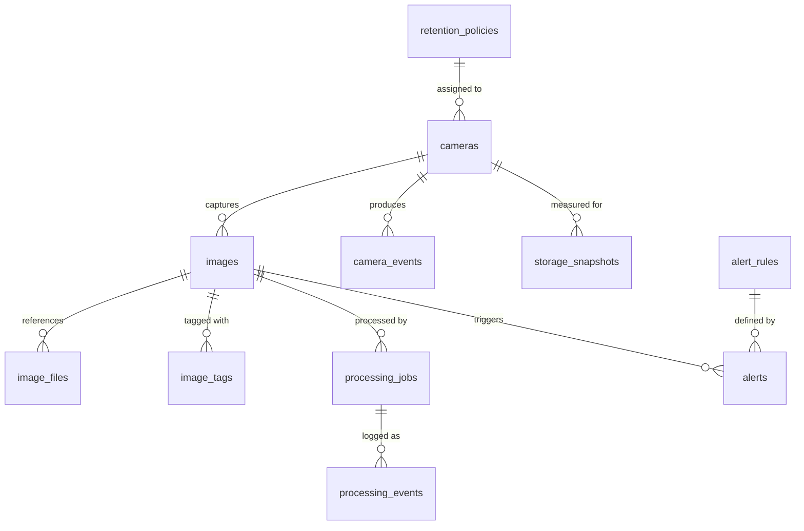
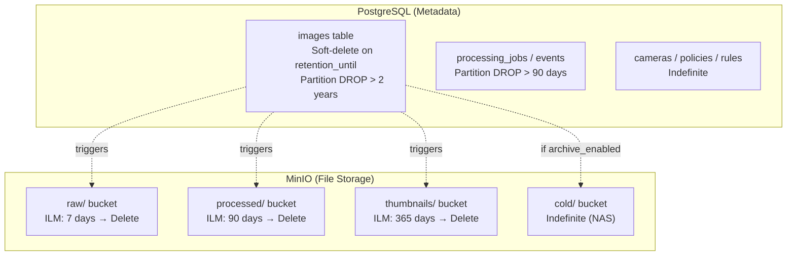

# Image Service — PostgreSQL Schema Design

> **Version:** 1.0
> **Database:** PostgreSQL 15
> **Domain:** Smart Factory Image Service

---

## Table of Contents

1. [ER Diagram](#1-er-diagram)
2. [Enum Types](#2-enum-types)
3. [Table Definitions](#3-table-definitions)
4. [Index Strategy](#4-index-strategy)
5. [Partition Strategy](#5-partition-strategy)
6. [Retention Strategy](#6-retention-strategy)
7. [Additional Considerations](#7-additional-considerations)

---

## 1. ER Diagram



### Entity Summary

| Entity | Rows (Est.) | Growth | Purpose |
|---|---|---|---|
| `retention_policies` | < 50 | Static | Retention duration per file tier |
| `cameras` | < 100 | Quasi-static | Camera registry & SMB credentials |
| `images` | 500K/day | High | Core image metadata |
| `image_files` | 1.5M/day | High | Per-file storage references (3 files/image) |
| `image_tags` | 500K/day | High | Flexible key-value annotations |
| `processing_jobs` | 500K/day | High | Job lifecycle tracking |
| `processing_events` | 2M/day | High | Detailed stage-level logs |
| `camera_events` | < 100/day | Low | Camera status transitions |
| `storage_snapshots` | 1/day | Very Low | Daily storage totals |
| `alerts` | < 50/day | Low | Active & historical alerts |
| `alert_rules` | < 100 | Static | Threshold configuration |

---

## 2. Enum Types

```sql
CREATE TYPE image_status AS ENUM (
    'pending',      -- Initial state after SMB discovery
    'queued',       -- Job enqueued to Redis
    'processing',   -- Actively being processed
    'completed',    -- Successfully processed & stored
    'failed',       -- Processing failed (retries exhausted)
    'deleted',      -- Soft-deleted (retention purge or manual)
    'archived'      -- Moved to cold storage tier
);

CREATE TYPE job_status AS ENUM (
    'queued',
    'running',
    'completed',
    'failed',
    'retrying',
    'dead_letter'   -- Max retries exceeded
);

CREATE TYPE job_type AS ENUM (
    'sync',                -- SMB file discovery
    'convert',             -- TIFF to PNG conversion
    'thumbnail',           -- Thumbnail generation
    'checksum',            -- Integrity verification
    'archive',             -- Move to cold storage
    'delete',              -- Retention-based deletion
    'retention_sweep',     -- Scheduled retention enforcement
    'health_check'         -- Camera connectivity check
);

CREATE TYPE file_type AS ENUM (
    'raw',                  -- Original TIFF
    'processed',            -- Converted PNG
    'thumbnail',            -- Resized preview
    'metadata_json'         -- Sidecar metadata
);

CREATE TYPE storage_class AS ENUM (
    'hot',      -- MinIO primary storage (NVMe)
    'warm',     -- MinIO with compression
    'cold'      -- NAS / Synology
);

CREATE TYPE camera_status AS ENUM (
    'active',
    'inactive',
    'error',
    'maintenance'
);

CREATE TYPE alert_severity AS ENUM (
    'info',
    'warning',
    'critical',
    'emergency'
);

CREATE TYPE alert_type AS ENUM (
    'storage_warning',
    'processing_failure',
    'camera_offline',
    'rate_limit_exceeded',
    'retention_violation',
    'disk_space',
    'ingest_lag',
    'checksum_mismatch'
);

CREATE TYPE camera_event_type AS ENUM (
    'online',
    'offline',
    'error',
    'reconfigured',
    'maintenance_start',
    'maintenance_end',
    'image_deleted'
);
```

---

## 3. Table Definitions

### 3.1 `retention_policies`

```sql
CREATE TABLE retention_policies (
    id                  UUID PRIMARY KEY DEFAULT gen_random_uuid(),
    name                VARCHAR(128) NOT NULL,
    description         TEXT,
    raw_retention_days  INTEGER NOT NULL DEFAULT 7,
    processed_retention_days INTEGER NOT NULL DEFAULT 90,
    thumbnail_retention_days  INTEGER NOT NULL DEFAULT 365,
    archive_raw_days    INTEGER,           -- NULL = never archive; days before moving raw to cold
    archive_enabled     BOOLEAN NOT NULL DEFAULT FALSE,
    cold_storage_class  storage_class NOT NULL DEFAULT 'cold',
    created_at          TIMESTAMPTZ NOT NULL DEFAULT NOW(),
    updated_at          TIMESTAMPTZ NOT NULL DEFAULT NOW(),
    CONSTRAINT positive_retention CHECK (
        raw_retention_days > 0
        AND processed_retention_days > 0
        AND thumbnail_retention_days > 0
    ),
    CONSTRAINT archive_before_raw CHECK (
        archive_raw_days IS NULL OR archive_raw_days < raw_retention_days
    )
);
```

**Purpose:** Defines how long each file tier is retained per camera. Multiple cameras can share a policy.

---

### 3.2 `cameras`

```sql
CREATE TABLE cameras (
    id                    UUID PRIMARY KEY DEFAULT gen_random_uuid(),
    name                  VARCHAR(128) NOT NULL,
    description           TEXT,
    ip_address            INET NOT NULL,
    smb_share_path        TEXT NOT NULL,
    smb_domain            VARCHAR(128),
    smb_username          VARCHAR(256) NOT NULL,
    smb_password_encrypted TEXT NOT NULL,          -- pgcrypto encrypted
    smb_subdirectory_pattern VARCHAR(256),         -- e.g. {YYYY}/{MM}/{DD}/
    status                camera_status NOT NULL DEFAULT 'inactive',
    poll_interval_seconds INTEGER NOT NULL DEFAULT 30,
    timezone              VARCHAR(64) DEFAULT 'UTC',
    metadata              JSONB DEFAULT '{}',      -- manufacturer, model, resolution, lens
    capture_mode          VARCHAR(32) NOT NULL DEFAULT 'periodic'
                          CHECK (capture_mode IN ('on_demand', 'periodic', 'continuous')),
    retention_policy_id   UUID NOT NULL REFERENCES retention_policies(id),
    enabled               BOOLEAN NOT NULL DEFAULT TRUE,
    last_polled_at        TIMESTAMPTZ,
    last_image_at         TIMESTAMPTZ,
    total_images_count    BIGINT NOT NULL DEFAULT 0,
    created_at            TIMESTAMPTZ NOT NULL DEFAULT NOW(),
    updated_at            TIMESTAMPTZ NOT NULL DEFAULT NOW()
);

-- Encrypt SMB passwords using pgcrypto
-- Requires: CREATE EXTENSION IF NOT EXISTS pgcrypto;
-- Usage: pgp_sym_encrypt('plaintext', current_setting('app.smb_encryption_key'))
```

**Purpose:** Central registry for all camera sources. Stores SMB connection details (encrypted) and polling configuration. The `metadata` JSONB column captures camera-specific properties without schema changes.

**Camera metadata example:**
```json
{
  "manufacturer": "Basler",
  "model": "acA2040-55um",
  "sensor": "CMOSIS CMV4000",
  "resolution": "2040x2040",
  "pixel_format": "Mono8",
  "lens": "Kowa LM12HC",
  "firmware": "3.12.0"
}
```

---

### 3.3 `images` (Partitioned)

```sql
CREATE TABLE images (
    id                  UUID NOT NULL,
    camera_id           UUID NOT NULL REFERENCES cameras(id),
    original_filename   VARCHAR(512) NOT NULL,
    file_size_bytes     BIGINT NOT NULL,
    checksum_sha256     CHAR(64),
    checksum_md5        CHAR(32),              -- Fast dedup on ingest
    status              image_status NOT NULL DEFAULT 'pending',
    width_px            INTEGER,
    height_px           INTEGER,
    bit_depth           INTEGER,
    color_space         VARCHAR(32),
    compression_type    VARCHAR(64),
    compression_ratio   NUMERIC(5, 2),
    tiff_metadata       JSONB DEFAULT '{}',    -- Extracted TIFF tag dictionary
    captured_at         TIMESTAMPTZ NOT NULL,
    ingested_at         TIMESTAMPTZ NOT NULL DEFAULT NOW(),
    processed_at        TIMESTAMPTZ,
    deleted_at          TIMESTAMPTZ,
    retention_until     TIMESTAMPTZ,           -- Computed from policy at ingest time
    search_vector       TSVECTOR,              -- Populated by trigger
    created_at          TIMESTAMPTZ NOT NULL DEFAULT NOW()
) PARTITION BY RANGE (captured_at);

-- Create default partition for pre-partition data
CREATE TABLE images_default PARTITION OF images DEFAULT;
```

**Purpose:** Core table storing one row per captured image. Partitioned by `captured_at` for time-based data management. The `tiff_metadata` JSONB stores extracted TIFF tags (EXIF, IFD entries) without requiring schema changes for different camera models.

---

### 3.4 `image_files`

```sql
CREATE TABLE image_files (
    id              UUID PRIMARY KEY DEFAULT gen_random_uuid(),
    image_id        UUID NOT NULL REFERENCES images(id),
    file_type       file_type NOT NULL,
    bucket          VARCHAR(128) NOT NULL,
    object_key      TEXT NOT NULL,
    storage_class   storage_class NOT NULL DEFAULT 'hot',
    file_size_bytes BIGINT NOT NULL,
    checksum_sha256 CHAR(64),
    mime_type       VARCHAR(128),
    created_at      TIMESTAMPTZ NOT NULL DEFAULT NOW(),
    UNIQUE (image_id, file_type)
);
```

**Purpose:** Each image produces 3–4 files (raw TIFF, processed PNG, thumbnail, optional JSON sidecar). This table tracks the storage location and per-file metadata for each variant. The `UNIQUE (image_id, file_type)` constraint ensures exactly one file per type per image.

---

### 3.5 `image_tags`

```sql
CREATE TABLE image_tags (
    id          BIGSERIAL,
    image_id    UUID NOT NULL REFERENCES images(id),
    key         VARCHAR(128) NOT NULL,
    value       TEXT NOT NULL,
    created_at  TIMESTAMPTZ NOT NULL DEFAULT NOW(),
    PRIMARY KEY (id),
    UNIQUE (image_id, key)
);
```

**Purpose:** Flexible key-value tagging for images. Allows operators or downstream systems (e.g., AI Vision) to annotate images without schema changes. Examples: `defect_class: scratch`, `quality_score: 0.97`, `batch_id: B-2024-03`.

---

### 3.6 `processing_jobs`

```sql
CREATE TABLE processing_jobs (
    id              UUID PRIMARY KEY DEFAULT gen_random_uuid(),
    image_id        UUID REFERENCES images(id),          -- NULL for system-level jobs
    job_type        job_type NOT NULL,
    worker_id       VARCHAR(128),                        -- Hostname or container ID
    status          job_status NOT NULL DEFAULT 'queued',
    priority        INTEGER NOT NULL DEFAULT 0,
    queue_name      VARCHAR(64) NOT NULL DEFAULT 'default',
    payload         JSONB,
    result          JSONB,
    error_message   TEXT,
    error_details   JSONB,                               -- Stack trace, context
    retry_count     INTEGER NOT NULL DEFAULT 0,
    max_retries     INTEGER NOT NULL DEFAULT 3,
    queued_at       TIMESTAMPTZ NOT NULL DEFAULT NOW(),
    started_at      TIMESTAMPTZ,
    completed_at    TIMESTAMPTZ,
    duration_ms     INTEGER GENERATED ALWAYS AS (
                        CASE WHEN completed_at IS NOT NULL AND started_at IS NOT NULL
                        THEN EXTRACT(EPOCH FROM (completed_at - started_at))::INTEGER * 1000
                        END
                    ) STORED,
    created_at      TIMESTAMPTZ NOT NULL DEFAULT NOW()
);

CREATE INDEX idx_processing_jobs_queue ON processing_jobs (status, priority DESC, queued_at)
    WHERE status IN ('queued', 'retrying');
```

**Purpose:** Tracks every processing job end-to-end. Workers report status transitions through this table. The generated `duration_ms` column eliminates per-query calculation. The filtered index on queued jobs supports efficient worker polling.

---

### 3.7 `processing_events`

```sql
CREATE TABLE processing_events (
    id              BIGSERIAL,
    job_id          UUID NOT NULL REFERENCES processing_jobs(id),
    event_type      VARCHAR(32) NOT NULL
                    CHECK (event_type IN ('stage_start', 'stage_end', 'warning', 'error', 'info', 'metric')),
    stage_name      VARCHAR(128),                        -- e.g. 'tiff_read', 'png_convert', 'checksum'
    message         TEXT NOT NULL,
    metadata        JSONB DEFAULT '{}',
    created_at      TIMESTAMPTZ NOT NULL DEFAULT NOW(),

    PRIMARY KEY (id, created_at)
) PARTITION BY RANGE (created_at);
```

**Purpose:** Granular audit trail within each processing job. Each stage of the pipeline emits start/end events plus any warnings or metrics. Useful for debugging, performance analysis, and SLA monitoring.

---

### 3.8 `camera_events`

```sql
CREATE TABLE camera_events (
    id          BIGSERIAL PRIMARY KEY,
    camera_id   UUID NOT NULL REFERENCES cameras(id),
    event_type  camera_event_type NOT NULL,
    message     TEXT NOT NULL,
    metadata    JSONB DEFAULT '{}',
    created_at  TIMESTAMPTZ NOT NULL DEFAULT NOW()
);

CREATE INDEX idx_camera_events_timeline ON camera_events (camera_id, created_at DESC);
```

**Purpose:** Immutable timeline of camera state changes. Enables uptime calculations, incident response, and trend analysis.

---

### 3.9 `storage_snapshots`

```sql
CREATE TABLE storage_snapshots (
    id              BIGSERIAL PRIMARY KEY,
    camera_id       UUID REFERENCES cameras(id),     -- NULL = platform-wide aggregate
    snapshot_date   DATE NOT NULL,
    file_type       file_type NOT NULL,
    storage_class   storage_class NOT NULL DEFAULT 'hot',
    total_files     BIGINT NOT NULL DEFAULT 0,
    total_bytes     BIGINT NOT NULL DEFAULT 0,
    created_at      TIMESTAMPTZ NOT NULL DEFAULT NOW(),
    UNIQUE (camera_id, snapshot_date, file_type, storage_class)
);

-- Platform-wide aggregate view (uses same table)
CREATE VIEW storage_summary AS
SELECT
    snapshot_date,
    file_type,
    storage_class,
    SUM(total_files) AS total_files,
    SUM(total_bytes) AS total_bytes
FROM storage_snapshots
WHERE camera_id IS NULL
GROUP BY snapshot_date, file_type, storage_class
ORDER BY snapshot_date DESC;
```

**Purpose:** Daily storage usage snapshot per camera and platform-wide. Data inserted by a scheduled job at end of each day. Enables capacity trend analysis and billing/showback.

---

### 3.10 `alerts`

```sql
CREATE TABLE alerts (
    id              UUID PRIMARY KEY DEFAULT gen_random_uuid(),
    alert_type      alert_type NOT NULL,
    severity        alert_severity NOT NULL DEFAULT 'warning',
    source          VARCHAR(256),                     -- camera_id, worker_id, or 'system'
    title           VARCHAR(256) NOT NULL,
    message         TEXT NOT NULL,
    details         JSONB DEFAULT '{}',
    acknowledged_at TIMESTAMPTZ,
    acknowledged_by VARCHAR(128),
    resolved_at     TIMESTAMPTZ,
    resolved_by     VARCHAR(128),
    created_at      TIMESTAMPTZ NOT NULL DEFAULT NOW(),
    updated_at      TIMESTAMPTZ NOT NULL DEFAULT NOW()
);

CREATE INDEX idx_alerts_active ON alerts (severity, created_at DESC)
    WHERE resolved_at IS NULL;
```

**Purpose:** Central alert registry. All system components write alerts here. Active (unresolved) alerts are indexed for fast dashboard queries.

---

### 3.11 `alert_rules`

```sql
CREATE TABLE alert_rules (
    id                    UUID PRIMARY KEY DEFAULT gen_random_uuid(),
    name                  VARCHAR(128) NOT NULL,
    alert_type            alert_type NOT NULL,
    description           TEXT,
    enabled               BOOLEAN NOT NULL DEFAULT TRUE,
    condition             JSONB NOT NULL,             -- Threshold expression
    cooldown_minutes      INTEGER NOT NULL DEFAULT 60,
    notification_channels JSONB DEFAULT '[]',         -- [{type: "email", target: "..."}]
    created_at            TIMESTAMPTZ NOT NULL DEFAULT NOW(),
    updated_at            TIMESTAMPTZ NOT NULL DEFAULT NOW()
);
```

**Condition examples:**

```json
// Storage warning: trigger when disk usage > 85%
{"metric": "storage_usage_pct", "operator": ">", "value": 85, "duration_minutes": 10}

// Camera offline: no poll response for > 5 minutes
{"metric": "seconds_since_last_poll", "operator": ">", "value": 300}

// Ingest lag: last image older than 10 minutes
{"metric": "minutes_since_last_image", "operator": ">", "value": 10}
```

**Purpose:** Configurable alert thresholds. Rules are evaluated by the monitoring component; when triggered, an `alerts` row is created. Cooldown prevents alert storms.

---

## 4. Index Strategy

### 4.1 `images` — Indexes

```sql
-- Most common query: find images by camera within a time range
CREATE INDEX idx_images_camera_captured ON images (camera_id, captured_at DESC);

-- Retention sweeper: find expired images efficiently
CREATE INDEX idx_images_retention ON images (retention_until)
    WHERE status NOT IN ('deleted', 'archived');

-- Ingest dedup: fast check for duplicate files
CREATE INDEX idx_images_checksum ON images (checksum_md5, camera_id)
    WHERE status NOT IN ('deleted', 'archived');

-- Status-based queries: find pending/queued images
CREATE INDEX idx_images_status ON images (status, captured_at DESC)
    WHERE status IN ('pending', 'queued', 'processing', 'failed');

-- Full-text search across TIFF metadata
CREATE INDEX idx_images_search ON images USING GIN (search_vector);

-- Cleanup queries (older than X days)
CREATE INDEX idx_images_captured ON images (captured_at DESC);
```

### 4.2 `image_files` — Indexes

```sql
-- Fast lookup of all files for an image
CREATE INDEX idx_image_files_image ON image_files (image_id);

-- Storage query: count files by bucket and storage class
CREATE INDEX idx_image_files_storage ON image_files (storage_class, file_type);
```

### 4.3 `processing_jobs` — Indexes

```sql
-- Worker polling: find next job to process
CREATE INDEX idx_processing_jobs_queue ON processing_jobs
    (status, priority DESC, queued_at)
    WHERE status IN ('queued', 'retrying');

-- Job history for an image
CREATE INDEX idx_processing_jobs_image ON processing_jobs (image_id, created_at DESC);

-- Failed job alerting
CREATE INDEX idx_processing_jobs_failed ON processing_jobs (status, completed_at DESC)
    WHERE status IN ('failed', 'dead_letter');

-- Job type + date range reporting
CREATE INDEX idx_processing_jobs_type ON processing_jobs (job_type, queued_at DESC);
```

### 4.4 `processing_events` — Indexes

```sql
-- Events within a job
CREATE INDEX idx_processing_events_job ON processing_events (job_id, created_at);

-- Stage performance analysis
CREATE INDEX idx_processing_events_stage ON processing_events (stage_name, created_at DESC)
    WHERE event_type IN ('stage_start', 'stage_end');
```

### 4.5 `image_tags` — Indexes

```sql
-- Find images by tag key+value (e.g., defect_class=scratch)
CREATE INDEX idx_image_tags_lookup ON image_tags (key, value);

-- All tags for an image
CREATE INDEX idx_image_tags_image ON image_tags (image_id);
```

### 4.6 Summary of Index Maintenance

| Table | Write Rate | Index Write Amplification | Notes |
|---|---|---|---|
| `images` | 500K rows/day | ~6x (6 indexes) | GIN index is most expensive; vacuum aggressively |
| `processing_events` | 2M rows/day | ~2x | Partitioned; index per partition |
| `image_files` | 1.5M rows/day | ~2x | Small rows, well-indexed |
| `image_tags` | 500K rows/day | ~2x | Moderate write volume |
| `processing_jobs` | 500K rows/day | ~4x | Updates cause index churn (status changes) |

> **Vacuum Strategy:** Run `VACUUM` aggressively on high-write tables during off-peak hours. Use `autovacuum` with tuned thresholds:
> ```sql
> ALTER TABLE images SET (autovacuum_vacuum_scale_factor = 0.01);
> ALTER TABLE images SET (autovacuum_analyze_scale_factor = 0.005);
> ```

---

## 5. Partition Strategy

### 5.1 Partitioned Tables

| Table | Partition Key | Interval | Estimated Partitions |
|---|---|---|---|
| `images` | `captured_at` | Monthly | 24 (2 years) → 12/year |
| `processing_events` | `created_at` | Monthly | 24 (2 years) → 12/year |

### 5.2 Partition DDL

```sql
-- Monthly partition for images (example: 2025-01)
CREATE TABLE images_2025_01 PARTITION OF images
    FOR VALUES FROM ('2025-01-01') TO ('2025-02-01');

-- Monthly partition for processing_events
CREATE TABLE processing_events_2025_01 PARTITION OF processing_events
    FOR VALUES FROM ('2025-01-01') TO ('2025-02-01');
```

### 5.3 Automated Partition Management

Use a scheduled function to create partitions proactively:

```sql
CREATE OR REPLACE FUNCTION create_monthly_partition()
RETURNS void AS $$
DECLARE
    next_month DATE;
    partition_name TEXT;
    start_date TEXT;
    end_date TEXT;
BEGIN
    next_month := DATE_TRUNC('month', NOW()) + INTERVAL '3 months';

    -- Images table
    FOR i IN 0..2 LOOP
        start_date := TO_CHAR(next_month + (i || ' months')::INTERVAL, 'YYYY-MM-DD');
        end_date := TO_CHAR(next_month + ((i+1) || ' months')::INTERVAL, 'YYYY-MM-DD');
        partition_name := 'images_' || TO_CHAR(next_month + (i || ' months')::INTERVAL, 'YYYY_MM');

        IF NOT EXISTS (
            SELECT 1 FROM pg_class WHERE relname = partition_name
        ) THEN
            EXECUTE format(
                'CREATE TABLE %I PARTITION OF images FOR VALUES FROM (%L) TO (%L)',
                partition_name, start_date, end_date
            );
        END IF;
    END LOOP;

    -- Same logic for processing_events
END;
$$ LANGUAGE plpgsql;

-- Schedule via pg_cron or application cron
-- SELECT create_monthly_partition();
```

### 5.4 Partition Benefits

| Concern | Without Partitions | With Partitions |
|---|---|---|
| Retention purge | `DELETE FROM images WHERE ...` (slow, bloat) | `DROP TABLE images_2024_01` (instant) |
| Query time range | Full table scan (even with index) | Partition pruning to 1 month |
| VACUUM | Full table | Per-partition, faster |
| Maintenance window | Long | Per-partition, staggered |

### 5.5 Partition Retention

```sql
-- Drop partitions older than retention period
CREATE OR REPLACE FUNCTION drop_expired_partitions()
RETURNS void AS $$
DECLARE
    rec RECORD;
BEGIN
    FOR rec IN
        SELECT
            inhrelid::regclass AS partition_name,
            pg_get_expr(relpartbound, inhrelid) AS boundary
        FROM pg_inherits
        JOIN pg_class ON pg_inherits.inhrelid = pg_class.oid
        WHERE pg_class.relispartition
        AND pg_inherits.inhparent = 'images'::regclass
    LOOP
        -- Parse boundary date; if older than retention, drop
        -- (Simplified: drop partitions older than 2 years)
        -- Execute: DROP TABLE IF EXISTS partition_name;
    END LOOP;
END;
$$ LANGUAGE plpgsql;
```

---

## 6. Retention Strategy

### 6.1 Retention Calculation on Ingest

When an image is registered, `retention_until` is computed from the camera's assigned policy:

```sql
CREATE OR REPLACE FUNCTION compute_retention_until()
RETURNS TRIGGER AS $$
BEGIN
    NEW.retention_until := (
        SELECT CASE
            WHEN rp.archive_enabled AND rp.archive_raw_days IS NOT NULL
            THEN NEW.captured_at + (rp.raw_retention_days || ' days')::INTERVAL
            ELSE NEW.captured_at + (rp.processed_retention_days || ' days')::INTERVAL
        END
        FROM cameras c
        JOIN retention_policies rp ON rp.id = c.retention_policy_id
        WHERE c.id = NEW.camera_id
    );
    RETURN NEW;
END;
$$ LANGUAGE plpgsql;

CREATE TRIGGER trg_images_retention
    BEFORE INSERT ON images
    FOR EACH ROW
    EXECUTE FUNCTION compute_retention_until();
```

### 6.2 Retention Sweeper Flow

```
┌──────────────────────────────────────────────────────────┐
│                   Retention Sweeper                       │
│                    (daily cron job)                       │
├──────────────────────────────────────────────────────────┤
│                                                          │
│  1. Query: SELECT id, camera_id, captured_at             │
│     FROM images                                          │
│     WHERE retention_until < NOW()                        │
│       AND status NOT IN ('deleted', 'archived')          │
│     ORDER BY retention_until                             │
│     LIMIT 10000;                                         │
│                                                          │
│  2. For each image:                                      │
│     ├── Enqueue 'archive' job (if archive_enabled)       │
│     │   → Move raw TIFF to cold storage class            │
│     │   → Update image_files.storage_class               │
│     │   → Set images.status = 'archived'                 │
│     └── Else: Enqueue 'delete' job                       │
│         → Delete from MinIO (raw, processed, thumbnail)  │
│         → Set images.status = 'deleted'                  │
│         → Set images.deleted_at = NOW()                  │
│                                                          │
│  3. For partitioned data:                                │
│     DROP TABLE IF EXISTS partition_older_than_retention; │
│                                                          │
└──────────────────────────────────────────────────────────┘
```

### 6.3 Retention by Layer

| Layer | Table | Retention (Hot) | Purge Mechanism |
|---|---|---|---|
| Metadata | `images` | Indefinite (2+ years) | Soft-delete + periodic purge of `status = 'deleted'` older than 90 days |
| File refs | `image_files` | Indefinite | Cascading delete with image |
| Tags | `image_tags` | Indefinite | Cascading delete with image |
| Processing logs | `processing_jobs` | 90 days | Partition DROP |
| Processing events | `processing_events` | 30 days | Partition DROP (faster rotation) |
| Camera events | `camera_events` | 1 year | DELETE sweep (low volume) |
| Snapshots | `storage_snapshots` | 3 years | DELETE sweep (very low volume) |
| Alerts | `alerts` | 1 year | Soft-delete + DROP |

### 6.4 Retention Enforcement Summary



---

## 7. Additional Considerations

### 7.1 Full-Text Search Trigger

```sql
CREATE OR REPLACE FUNCTION images_search_update()
RETURNS TRIGGER AS $$
BEGIN
    NEW.search_vector :=
        setweight(to_tsvector('simple', COALESCE(NEW.original_filename, '')), 'A') ||
        setweight(to_tsvector('simple', COALESCE(NEW.checksum_sha256, '')), 'B') ||
        setweight(to_tsvector('english', COALESCE(NEW.tiff_metadata::text, '')), 'C');
    RETURN NEW;
END;
$$ LANGUAGE plpgsql;

CREATE TRIGGER trg_images_search
    BEFORE INSERT OR UPDATE OF original_filename, checksum_sha256, tiff_metadata
    ON images
    FOR EACH ROW
    EXECUTE FUNCTION images_search_update();
```

### 7.2 Camera Image Count Update

```sql
CREATE OR REPLACE FUNCTION update_camera_image_count()
RETURNS TRIGGER AS $$
BEGIN
    IF NEW.status = 'completed' THEN
        UPDATE cameras
        SET total_images_count = total_images_count + 1,
            last_image_at = NEW.captured_at
        WHERE id = NEW.camera_id;
    END IF;
    RETURN NULL;
END;
$$ LANGUAGE plpgsql;

CREATE TRIGGER trg_camera_image_count
    AFTER UPDATE OF status ON images
    FOR EACH ROW
    WHEN (NEW.status = 'completed' AND OLD.status != 'completed')
    EXECUTE FUNCTION update_camera_image_count();
```

### 7.3 Estimated Table Sizes (Medium Volume — 30 Cameras)

| Table | Rows | Row Size | Data Size | Index Size | Total |
|---|---|---|---|---|---|
| `images` | 190M (1 year) | ~400 B | ~76 GB | ~95 GB | ~171 GB |
| `image_files` | 570M (1 year) | ~200 B | ~114 GB | ~60 GB | ~174 GB |
| `processing_jobs` | 190M (1 year) | ~500 B | ~95 GB | ~45 GB | ~140 GB |
| `processing_events` | 730M (1 year) | ~300 B | ~219 GB | ~36 GB | ~255 GB |
| `image_tags` | 190M (1 year) | ~200 B | ~38 GB | ~30 GB | ~68 GB |
| Others | < 1M | — | < 5 GB | < 2 GB | < 7 GB |
| **Total** | | | **~547 GB** | **~268 GB** | **~815 GB** |

> **Storage Recommendation:** Allocate **1 TB NVMe** for PostgreSQL data directory at production scale. Use a dedicated volume with high IOPS. Enable `pg_repack` for online index maintenance.

### 7.4 Security

```sql
-- Extensions
CREATE EXTENSION IF NOT EXISTS pgcrypto;   -- SMB password encryption
CREATE EXTENSION IF NOT EXISTS pg_stat_statements;  -- Query performance

-- Row-Level Security on cameras (future multi-tenant)
ALTER TABLE cameras ENABLE ROW LEVEL SECURITY;

-- Encrypt sensitive camera credentials
-- INSERT example:
-- INSERT INTO cameras (...) VALUES (
--   pgp_sym_encrypt('smb_password', current_setting('app.encryption_key'))
-- );
```

### 7.5 Migration Strategy

| Phase | Tables | Approach |
|---|---|---|
| **Phase 0 (Dev)** | All tables | `CREATE TABLE` without partitioning |
| **Phase 1 (POC)** | All tables | Add partitioning manually as data grows |
| **Phase 2 (Pilot)** | `images`, `processing_events` | Automated partition creation via cron |
| **Phase 3 (Production)** | All high-volume tables | Full automated lifecycle (create → manage → drop) |

---

*End of Database Schema Document*
